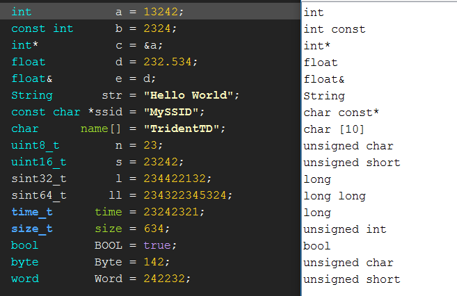

TridentTD_TypeName Library
============
TridentTD_TypeName คือ ไลบรารี่สำหรับตรวจสอบ  
ตัวแปร หรือ ออบเจค นั้น เป็นตัวแปรประเภทใด

โดยสามารถใช้ได้ทั้ง Arduino UNO/MEGE ฯลฯ  
ตลอดจน ESP8266/ESP32  หรือ STM32  

Usage
---
* ให้เพิ่มไลบรารี่ ด้วย 

```
   #include <TridentTD_TypeName.hpp>  
```

* เมื่อต้องการตรวจสอบว่าตัวแปรหรือ ออปเจคนั้นเป็นประเภทใด  
   ใช้คำสั่ง DECL_TYPENAME(ตัวแปร);
```
   int   a =  12345;
   String a_type = DECL_TYPENAME(a);
   Serial.println( a_type);    // จะแสดงผลคือ int
```

ตัวอย่างผลการเรียกใช้คำสั่ง 
---
  
  
_17 พฤษภาคม 2561BE  (2018)_  
 **TridentTD**_ 
 
 
